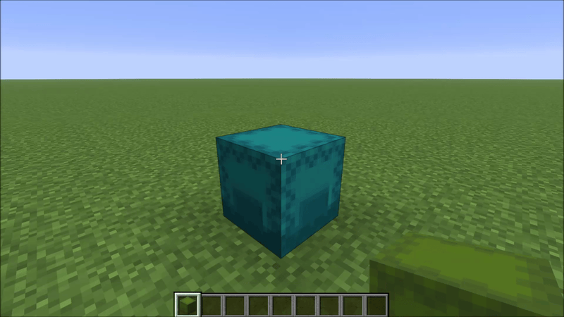
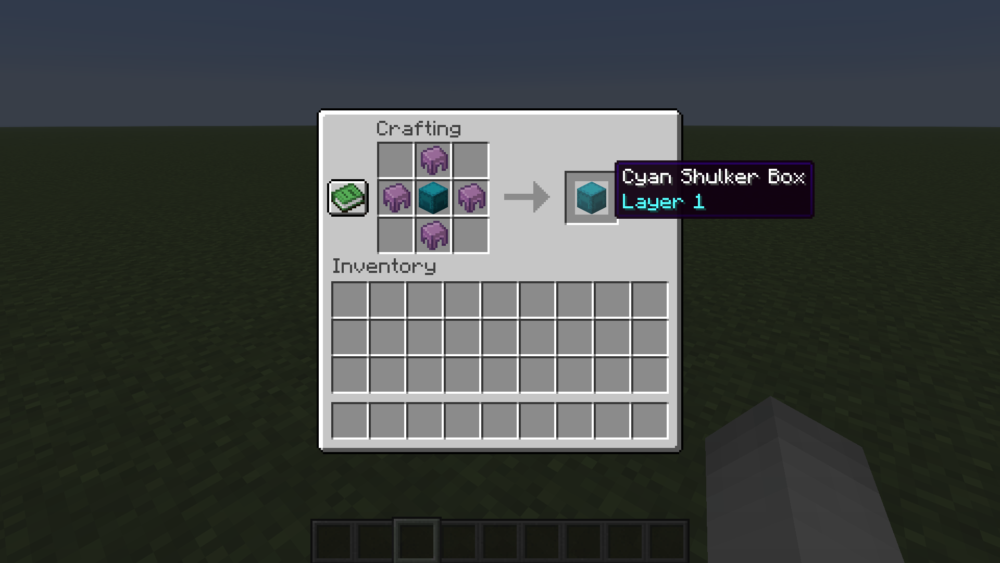
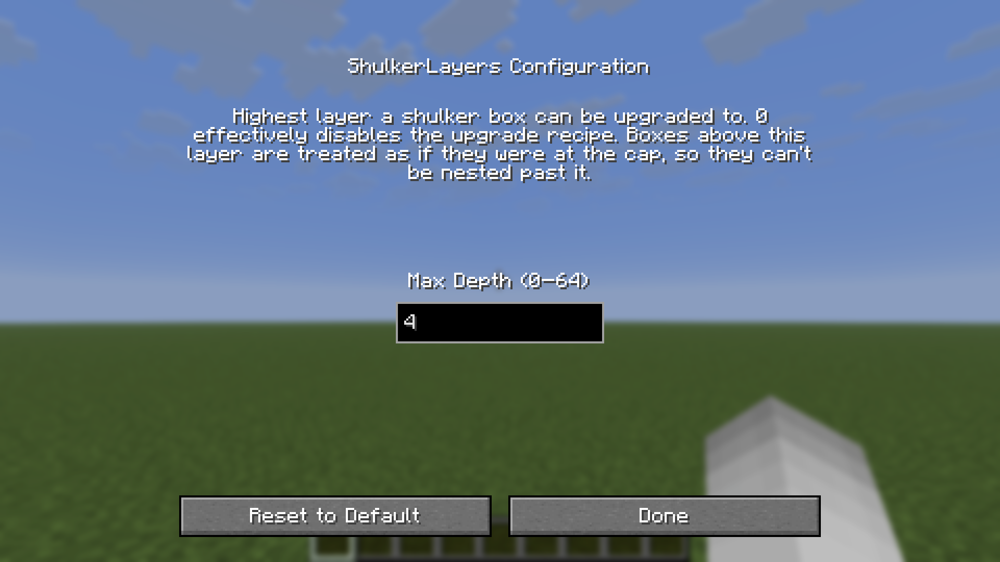

# ShulkerLayers

A Fabric mod for Minecraft that lets you pack shulker boxes inside shulker boxes, with a configurable nesting depth.


## What it does

Vanilla Minecraft blocks placing a shulker box into another shulker box. ShulkerLayers lifts that restriction in a controlled way: every shulker box gets a hidden **layer** value, and a higher-layer box can hold lower-layer boxes inside it. This lets you build compact, organized storage without spiraling into infinite recursion.



## How it works

- **Layers.** Every shulker box has an integer `layer` (0 by default). A regular crafted/looted shulker box is layer 0.
- **Upgrade recipe.** Surround any shulker box with shulker shells in a `+` pattern (same as the original shulker box recipe) to bump its layer up by 1. The output keeps the input box's color, contents, and custom name.
- **Nesting rule.** A box may be placed inside another shulker box only if the inner box's layer is *lower* than the outer box's layer. So a layer-0 box fits into a layer-1 box; a layer-1 box fits into a layer-2 box; and so on. Boxes of equal or higher layer are rejected. This guarantees you can never nest infinitely.
- **Tooltip.** A box with layer ≥ 1 shows its layer in its tooltip.



The upgrade recipe (where `S` = shulker shell, `B` = any shulker box):

```
  S
S B S
  S
```

## Configuration

A config file is created at `<game>/config/shulkerlayers.json` on first launch:

```json
{
  "maxDepth": 3
}
```

| Key        | Type | Default | Range  | Description                                                                          |
| ---------- | ---- | ------- | ------ | ------------------------------------------------------------------------------------ |
| `maxDepth` | int  | `3`     | 0 – 64 | Highest layer a shulker box can be upgraded to. `0` effectively disables the recipe. Boxes above this layer are treated as if they were at the cap, so they cannot be nested past it. |

### Mod Menu Support

With [Mod Menu](https://modrinth.com/mod/modmenu) installed, `maxDepth` can also be edited in-game from the mod list — changes apply immediately (singleplayer), no restart needed. Mod Menu is optional: without it the JSON file is used.



## Installation

1. Install [Fabric Loader](https://fabricmc.net/use/) and [Fabric API](https://modrinth.com/mod/fabric-api).
2. Drop the ShulkerLayers `.jar` into your `mods/` folder.
3. Launch the game.

Server and client both need the mod installed (the `layer` data component is network-synchronized).

## Compatibility

- Targets Minecraft 26.2.
- Fabric Loader ≥ 0.19.3, Java 25.
- Should be compatible with most mods that don't themselves rewrite `ShulkerBoxBlockEntity` or `ShulkerBoxSlot.mayPlace`. Mixins are scoped tightly to those classes plus `ShapedRecipe#matches`/`assemble` (only triggers on the layer-upgrade recipe) and `ItemStack#addDetailsToTooltip`.

## License

Released under the [MIT License](LICENSE).
